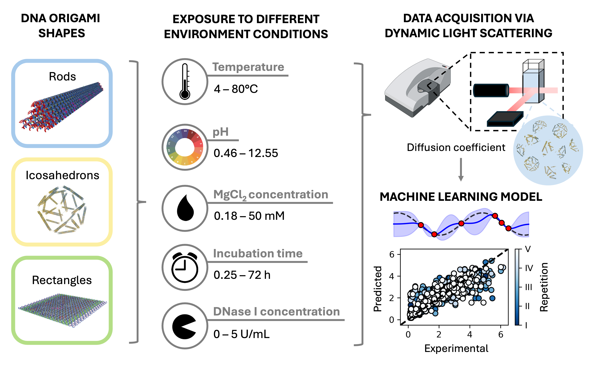

# DNA-origami-stability-prediction

<!--  -->

<!-- Title-->
<h1 id="Title">Predicting DNA origami stability in physiological media by machine learning</h1>

**Judith Zubia-Aranburu**1, **Andrea Gardin**1, **Lars Paffen**, **Matteo Tollemeto**, **Ane Alberdi**, **Maite Termenon**, **Francesca Grisoni**\*, **Tania Patiño Padial**\*\
1These authors contributed equally to this work.\
\*Corresponding authors: j.c.m.v.hest@tue.nl, f.grisoni@tue.nl, l.brunsveld@tue.nl.

<h2 id="disclaimer">Disclaimer</h2>

_This repo is not the final version an can be subjected to changes._

<!-- Abstract-->
<h2 id="abstract">Abstract</h2>
DNA origami nanostructures offer substantial potential as programmable, biocompatible platforms for drug delivery and diagnostics. However, their structural stability under physiological conditions remains a major barrier to practical applications. Stability assessment of DNA origami nanostructures has traditionally relied on image-based and empirical approaches, which are time-consuming and difficult to generalize across conditions. To address these limitations, we developed a machine learning approach for DNA origami stability prediction, based on measurable physicochemical parameters. Using dynamic light scattering (DLS) to quantify diffusion coefficients as a proxy for structural integrity, we characterized over 1400 DNA origami samples under varying physiologically relevant variables: temperature, incubation time, MgCl2 concentration, pH, and DNase I concentrations. The predictive performance of the model was confirmed using an independent set of samples under previously untested conditions. This data-driven approach offers a scalable and generalizable framework to guide the design of robust DNA nanostructures for biomedical applications.

<!-- Content-->
<h2 id="content">Content</h2>

This repository contains the code used to apply the active machine learning pipeline described in the main [paper](https://www.biorxiv.org/content/10.1101/2025.07.18.665506v1).\
This repository is structured in the following way:
-   `/datasets/` : folder containing the datasets used to train/test/validate the models in our experiments.
-   `/figures/` : folder containig high resolution figure as reported in the main paper.
-   `/origamiregressor/` : main folder containig the `.py` modules defining the package.
-   `/script/` : 
